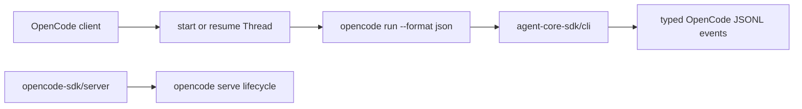
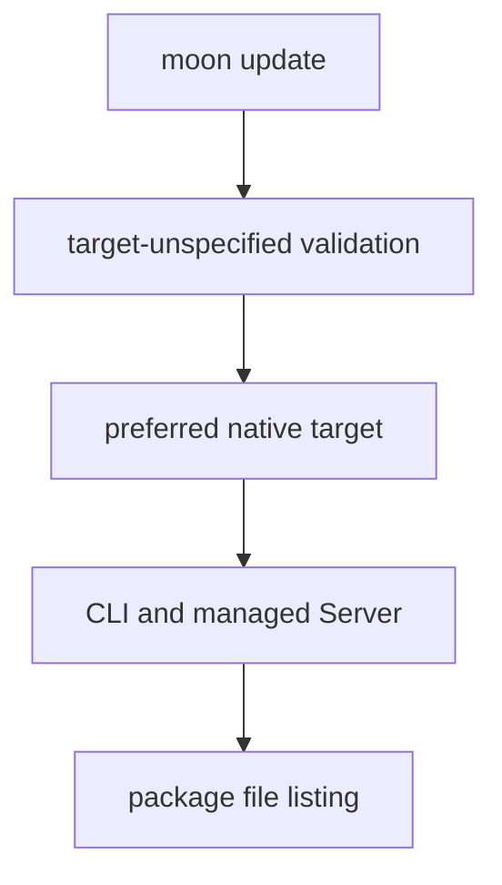

# OpenCode SDK for MoonBit

Embed the OpenCode agent in MoonBit workflows and applications through the installed [`opencode run --format json`](https://dev.opencode.ai/docs/cli/) command.

The public client shape intentionally follows `totto2727/codex-sdk`: create an `OpenCode` client, start or resume a `Thread`, then call `run` or `run_streamed`. Provider-specific options and events remain OpenCode-native because the CLIs do not share a wire protocol.



## Usage

```mbt check
///|
async fn example {
  let opencode = @opencode_sdk.OpenCode::OpenCode()
  let thread = opencode.start_thread(
    options=@opencode_sdk.ThreadOptions::ThreadOptions(
      model="opencode-go/deepseek-v4-flash",
    ),
  )
  let turn = thread.run(
    @opencode_sdk.Input::Prompt("Explain this repository in one paragraph."),
  )
  println(turn.final_response)
}
```

Add the CLI package to a MoonBit project and import it with an alias:

```mbt
import {
  "totto2727/opencode-sdk@0.3.0",
}
```

```mbt
import {
  "totto2727/opencode-sdk/cli" @opencode_sdk,
}
```

## Streaming

MoonBit uses an asynchronous callback in place of an async generator.

```mbt check
///|
async fn stream_example {
  let thread = @opencode_sdk.OpenCode::OpenCode().start_thread()
  thread.run_streamed(
    @opencode_sdk.Input::Prompt("Summarize the current changes."),
    async fn(event) {
      match event {
        @opencode_sdk.Text(text) => println(text.text)
        _ => ()
      }
      @async.pause()
    },
  )
}
```

`ThreadEvent` models the JSONL events emitted by the OpenCode CLI: completed text and reasoning parts, completed or failed tool calls, step start and finish records, and stream errors. Step-finish events retain cost and token usage, while `Thread::run` joins completed text parts into `Turn::final_response`.

## Options and lifecycle

`OpenCodeOptions` accepts an explicit executable path, an environment map, and recursively typed configuration serialized to `OPENCODE_CONFIG_CONTENT`. `ThreadOptions` forwards model, agent, working directory, variant, title, and thinking output through the corresponding official CLI flags, while `UserInputs` forwards local files with repeated `--file` flags.

The task that calls `run` or `run_streamed` owns the OpenCode subprocess. Cancelling that task hard-cancels and waits for the child process before control returns.

## Validation conditions

The module and CLI package declare `+wasm+native` support with `native` as the preferred target. The managed Server package remains native-only because it depends on the native process and filesystem APIs.

CI runs target-unspecified `moon check`, `moon test`, and `moon build`, so MoonBit selects the module's preferred `native` target and validates the complete module, including the managed Server. `moon package --list` validates the published file set. The CLI's Wasm support remains declared but is not part of the regular CI gate. This follows MoonBit's [`supported_targets` and `preferred_target` model](https://docs.moonbitlang.com/en/latest/toolchain/moon/module.html).



## Managed Server lifecycle

The managed Server lifecycle is a separate native package. It starts `opencode serve`, waits for the announced URL, and owns close/cleanup only; it does not provide an HTTP client or share CLI types.

```mbt
import {
  "totto2727/opencode-sdk/server" @opencode_server,
}

async fn server_example {
  @async.with_task_group() <| group => {
    let server = @opencode_server.create_opencode_server(group)
    println(server.url())
    server.close()
  }
}
```

The task group must outlive the returned Server. Call `Server::close` inside the task-group body on both success and failure; task-group defers run only after child tasks finish, while the managed Server is itself a long-lived child task.

The executable health example is in [`src/server/examples/health`](src/server/examples/health).

## Migration

Version 0.3.0 is a breaking migration: the former CLI import `totto2727/opencode-sdk` is now `totto2727/opencode-sdk/cli`. The former managed lifecycle import `totto2727/opencode-server-sdk` is now `totto2727/opencode-sdk/server`. The two packages retain distinct contracts. The CLI package directly depends on `totto2727/agent-core-sdk/cli`, which has no target- or runtime-specific subpackage.
