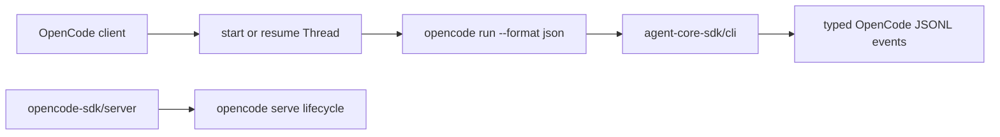
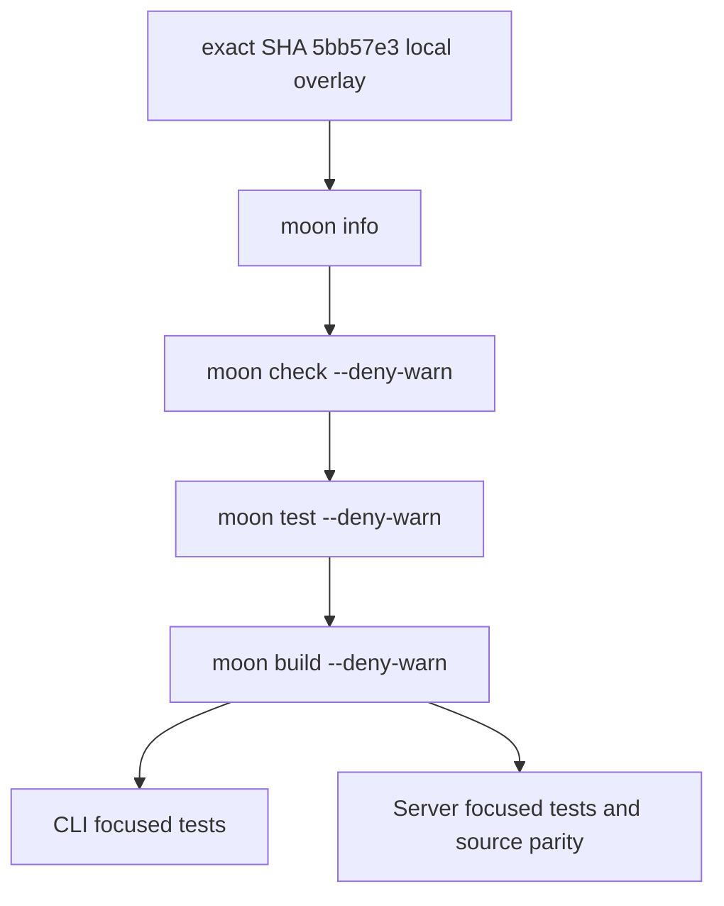

# MoonBit 向け OpenCode SDK

インストール済みの [`opencode run --format json`](https://dev.opencode.ai/docs/cli/) を通じて、MoonBit のワークフローとアプリケーションに OpenCode agent を組み込みます。

公開クライアントの形は意図的に `totto2727/codex-sdk` に合わせています。`OpenCode` client を作成して `Thread` を開始または再開し、`run` か `run_streamed` を呼び出します。CLI 間で wire protocol は共有しないため、provider 固有の option と event は OpenCode 固有のままです。



## 使い方

```mbt check
///|
async fn example {
  let opencode = @opencode_sdk.OpenCode::OpenCode()
  let thread = opencode.start_thread(
    options=@opencode_sdk.ThreadOptions::ThreadOptions(
      model="opencode-go/deepseek-v4-flash",
    ),
  )
  let turn = thread.run(
    @opencode_sdk.Input::Prompt("Explain this repository in one paragraph."),
  )
  println(turn.final_response)
}
```

MoonBit project に CLI package を追加し、alias 付きで import します。

```mbt
import {
  "totto2727/opencode-sdk@0.3.0",
}
```

```mbt
import {
  "totto2727/opencode-sdk/cli" @opencode_sdk,
}
```

## Streaming

MoonBit では async generator の代わりに asynchronous callback を使用します。

```mbt check
///|
async fn stream_example {
  let thread = @opencode_sdk.OpenCode::OpenCode().start_thread()
  thread.run_streamed(
    @opencode_sdk.Input::Prompt("Summarize the current changes."),
    async fn(event) {
      match event {
        @opencode_sdk.Text(text) => println(text.text)
        _ => ()
      }
      @async.pause()
    },
  )
}
```

`ThreadEvent` は OpenCode CLI が出力する JSONL event を model 化します。完了した text と reasoning part、成功または失敗した tool call、step の開始と終了 record、stream error を扱います。step-finish event は cost と token usage を保持し、`Thread::run` は完了 text part を `Turn::final_response` に連結します。

## Option と lifecycle

`OpenCodeOptions` は executable path、environment map、`OPENCODE_CONFIG_CONTENT` に serialize する再帰的に typed な configuration を受け取ります。`ThreadOptions` は model、agent、working directory、variant、title、thinking output を対応する公式 CLI flag に渡し、`UserInputs` は local file を繰り返しの `--file` flag として渡します。

`run` または `run_streamed` を呼び出す task が OpenCode subprocess を所有します。task を cancel すると child process を hard-cancel して wait してから制御を返します。

## 検証条件



## Managed Server lifecycle

managed Server lifecycle は別の native package です。`opencode serve` を開始し、通知された URL を待機し、close/cleanup だけを所有します。HTTP client は提供せず、CLI type も共有しません。

```mbt
import {
  "totto2727/opencode-sdk/server" @opencode_server,
}

async fn server_example {
  @async.with_task_group() <| group => {
    let server = @opencode_server.create_opencode_server(group)
    println(server.url())
    server.close()
  }
}
```

task group は返却された Server より長く生存する必要があります。task-group body の成功時と failure 時の両方で `Server::close` を呼び出してください。managed Server 自身が長寿命の child task であり、task-group の defer は child task の終了後に実行されます。

実行可能な health example は [`src/examples/health`](src/examples/health) にあります。

## Migration

Version 0.3.0 は破壊的な migration です。以前の CLI import `totto2727/opencode-sdk` は `totto2727/opencode-sdk/cli` になり、以前の managed lifecycle import `totto2727/opencode-server-sdk` は `totto2727/opencode-sdk/server` になりました。2 package の contract は分離されたままです。CLI package は、target/runtime 固有の subpackage を持たない `totto2727/agent-core-sdk/cli` に直接依存します。
