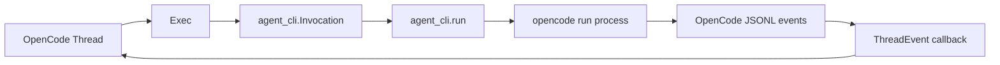
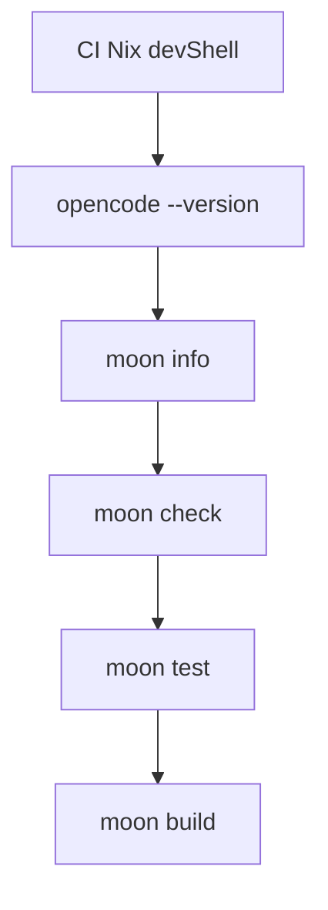

# OpenCode SDK for MoonBit

Embed the OpenCode agent in MoonBit workflows and applications through the installed [`opencode run --format json`](https://dev.opencode.ai/docs/cli/) command.

The public client shape intentionally follows `totto2727/codex-sdk`: create a `Client`, start or resume a `Thread`, then call `run` or `run_streamed`. Provider-specific options and events remain OpenCode-native because the CLIs do not share a wire protocol.

The `opencode` executable must be available on `PATH` for native process execution, or supplied with `Options.executable_path_override`.

## Target support

- CLI: `wasm` (preferred), `native`
- Server: `native`

## Development shells

The default Nix development shell contains only the MoonBit toolchain. The CI shell derives from it and adds the Nix-managed `opencode` executable from the official [`anomalyco/opencode`](https://github.com/anomalyco/opencode) flake overlay. The workflow uses the shared Nix and MoonBit actions from [`totto2727-org/monorepo@main`](https://github.com/totto2727-org/monorepo/tree/main/.github/actions), with a job-level `NIX_DEV_SHELL` selecting the CI shell for both MoonBit actions.

```sh
nix develop
nix develop .#ci --command opencode --version
```

## Quickstart

```mbt check
///|
async fn example {
  let client = @opencode.Client::Client()
  let thread = client.start_thread(
    options=@opencode.ThreadOptions::ThreadOptions(
      model="opencode-go/deepseek-v4-flash",
    ),
  )
  let turn = thread.run(
    @opencode.Input::Prompt("Explain this repository in one paragraph."),
  )
  println(turn.final_response)
}
```

Call `run` repeatedly on the same `Thread` value to continue that OpenCode session.

## Streaming responses

MoonBit uses an asynchronous callback in place of an async generator.

```mbt check
///|
async fn stream_example {
  let thread = @opencode.Client::Client().start_thread()
  thread.run_streamed(
    @opencode.Input::Prompt("Summarize the current changes."),
    async fn(event) {
      match event {
        @opencode.Text(text) => println(text.text)
        _ => ()
      }
      @async.pause()
    },
  )
}
```

`ThreadEvent` models the JSONL events emitted by the OpenCode CLI: completed text and reasoning parts, completed or failed tool calls, step start and finish records, and stream errors. Step-finish events retain cost and token usage, while `Thread::run` joins completed text parts into `Turn::final_response`.

## Options and lifecycle

`Options` accepts an explicit executable path, an environment map, and recursively typed configuration serialized to `OPENCODE_CONFIG_CONTENT`. `ThreadOptions` forwards model, agent, working directory, variant, title, and thinking output through the corresponding official CLI flags, while `UserInputs` forwards local files with repeated `--file` flags.

The task that calls `run` or `run_streamed` owns the OpenCode subprocess. Cancelling that task hard-cancels and waits for the child process before control returns.

## Agent core integration

The CLI package depends directly on `totto2727/agent-core-sdk/cli`. `Exec` owns OpenCode-specific argument construction and event conversion, while `agent_core_sdk/cli.run` owns the JSONL process lifecycle. No target-specific `cli/native` package or backend is used.



The CLI source layout uses the same package-neutral filenames as the Codex SDK:

| Responsibility | MoonBit |
| --- | --- |
| Client lifecycle | `client.mbt` |
| Client options and configuration | `options.mbt` |
| Provider events | `events.mbt` |
| CLI process adapter | `exec.mbt` |
| Thread lifecycle | `thread.mbt` |
| Thread options | `thread_options.mbt` |

## Managed Server lifecycle

The managed Server lifecycle is a separate native package. It starts `opencode serve`, waits for the announced URL, and owns close/cleanup only; it does not provide an HTTP client or share CLI types.

```mbt
import {
  "totto2727/opencode-sdk/server" @opencode_server,
}

async fn server_example {
  @async.with_task_group() <| group => {
    let server = @opencode_server.create_opencode_server(group)
    println(server.url())
    server.close()
  }
}
```

The task group must outlive the returned Server. Call `Server::close` inside the task-group body on both success and failure; task-group defers run only after child tasks finish, while the managed Server is itself a long-lived child task.

The executable health example is in [`src/server/examples/health`](src/server/examples/health).

## Tests

Run the preferred-target package checks from the repository root:

```sh
moon check
moon test
moon build
```

The module still declares native and wasm CLI support. Pass an explicit `--target` only when deliberately validating a declared non-preferred target locally. The native-only managed Server is not selected by preferred Wasm validation.

The preferred-target suite covers each typed OpenCode event decoder, including malformed and unknown events. Native tests use fake OpenCode executables to cover arguments, environment, JSONL parsing, failures, cancellation, session continuation, resume, and streamed events. Separate native Server tests cover option forwarding, readiness parsing, idempotent close, malformed readiness, timeout, early exit, and child cleanup.

## Test conditions


